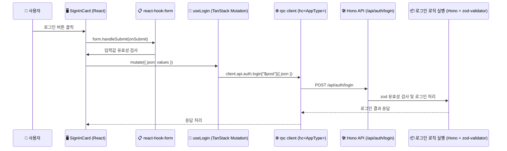

# 로그인 시퀀스 다이어그램

```mermaid
sequenceDiagram
    participant User as 👤 사용자
    participant UI as 🖥️ SignInCard (React)
    participant Form as 📋 react-hook-form
    participant Query as 🔄 useLogin (TanStack Mutation)
    participant Client as 🌐 rpc client (hc<AppType>)
    participant API as 🛠️ Hono API (/api/auth/login)
    participant Server as 📦 로그인 로직 실행 (Hono + zod-validator)

    User->>UI: 로그인 버튼 클릭
    UI->>Form: form.handleSubmit(onSubmit)
    Form->>UI: 입력값 유효성 검사
    UI->>Query: mutate({ json: values })
    Query->>Client: client.api.auth.login["$post"]({ json })
    Client->>API: POST /api/auth/login
    API->>Server: zod 유효성 검사 및 로그인 처리
    Server-->>Client: 로그인 결과 응답
    Client-->>UI: 응답 처리
```